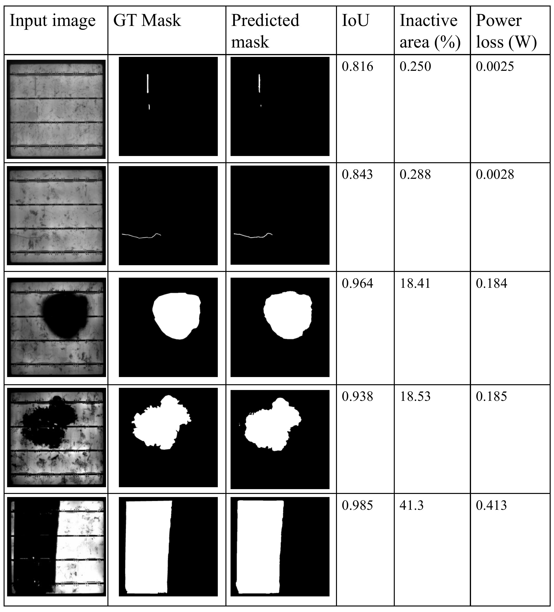

# SolarTopoCrackNet

**STC-Net: Electroluminescence-Based Solar Cell Crack Segmentation for Power Loss Estimation**

A topology-aware deep-learning framework for solar-cell crack segmentation from electroluminescence (EL) images.

**Accepted to IEEE MERCon 2026 and nominated for Best Paper.**

[Paper on arXiv](https://arxiv.org/abs/2608.01714)

---

## Highlights

STC-Net is designed for thin, fragmented, and low-contrast cracks in EL images. Its main contributions are:

* **Frequency-guided spectral pyramid** to suppress regular solar-cell texture and emphasize abnormal EL responses.
* **Edge-aware structural guidance** for improved localization of thin crack boundaries.
* **Topology-aware learning** to preserve crack connectivity and centerline structure.
* **Boundary-topology refinement** combining region, edge, and topology predictions.
* **Crack-associated inactive-area estimation** as a surrogate for photovoltaic power degradation.

---

## Architecture

<p align="center">
  
</p>

---

## Results

Performance reported on the **PVEL-S** dataset:

| Metric          |       STC-Net |
| --------------- | ------------: |
| Test MIoU       |    **72.52%** |
| Test MDice      |    **80.16%** |
| Recall          |    **83.18%** |
| Precision       |    **84.23%** |
| Inference Speed | **41.38 FPS** |

Representative qualitative results:

<p align="center">
  
</p>

---

## Environment

```text
Python 3.6.13
PyTorch 1.7.1
torchvision 0.8.2
OpenCV 3.4.x
```

Install dependencies:

```bash
pip install -r requirements_py36_torch171.txt
```

---

## Dataset Structure

```text
train/
  images/
  masks/

test/
  images/
  masks/
```

Images and masks are paired by filename stem.

---

## Training

Set dataset paths in:

```text
configs/solar_topo_crack_py36.yaml
```

Then run:

```bash
python train.py --config configs/solar_topo_crack_py36.yaml
```

---

## Inference

```bash
python infer.py \
  --config configs/solar_topo_crack_py36.yaml \
  --checkpoint outputs/solar_topo_crack_py36/checkpoints/best.pt \
  --input_dir /path/to/test/images \
  --output_dir ./predictions \
  --save_aux
```

For crack segmentation with degradation estimation:

```bash
python infer_crack_power_eval.py \
  --config configs/solar_topo_crack_py36.yaml \
  --checkpoint outputs/solar_topo_crack_py36/checkpoints/best.pt \
  --input_dir /path/to/test/images \
  --gt_mask_dir /path/to/test/masks \
  --output_dir ./outputs/test_infer_power \
  --nominal_power 1.0 \
  --cell_mode full_image \
  --threshold 0.4
```

---

## Notes

* Binary masks should use black background and white foreground.
* Tune the segmentation threshold on the validation set.
* For sparse crack masks, increasing `seg_pos_weight` and `topo_pos_weight` may help.
* The power-loss output is an **inactive-area-based surrogate estimate**, not a direct electrical power measurement.

---

## Citation

If you use this work, please cite the paper:

```bibtex
@INPROCEEDINGS{11691399,
  author={Gunasekara, Shanaka Ramesh and Jayasinghe, Akila Eranda and Guruge, Imasha and Fernando, Nuwantha and Asadi, Ehsan},
  booktitle={2026 Moratuwa Engineering Research Conference (MERCon)}, 
  title={STC-Net: Electroluminescence-Based Solar Cell Crack Segmentation for Power Loss Estimation}, 
  year={2026},
  volume={},
  number={},
  pages={526-531},
  keywords={Cells (biology);Equations;Decoding;Modeling;Topology;Modules (abstract algebra);Photovoltaic cells;Tagging;Printing;Degradation;Solar cell defect segmentation;power loss estimation;computer vision},
  doi={10.1109/MERCon71835.2026.11691399}}

}
```
